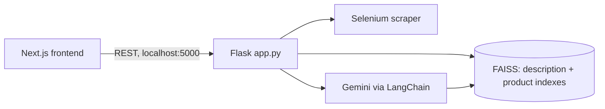

# Chat with Any Website

**Point it at a website and get a customer-support chatbot: it scrapes the site, uses Gemini to classify pages, indexes them in FAISS and answers questions with retrieval-augmented generation.**

## What it does

A Flask backend plus Next.js frontend that turns a business website into a knowledge base for a support chatbot. The bundled frontend demo is themed as an Indian restaurant (product images such as biryani and masala dosa).

## Features

- **URL extraction** (`POST /extract-urls`): headless Selenium Chrome collects navigation URLs from a homepage
- **LLM URL classification**: Gemini structured output splits URLs into description pages and product/service pages; editable via `/update-url-classification`
- **Two FAISS vector stores** (`backend/vectors/description_index`, `product_info_index`) built from scraped pages or pasted text (`/process-desc-urls`, `/process-product-urls`, `/process-desc-text`, `/process-product-text`)
- **Content management**: view/add/remove descriptions and products (`/view-all-*`, `/add-*`, `/remove-*`); products are normalised to a structured list by the LLM
- **Adaptive retrieval** (`POST /chatbot`): an LLM-chosen ratio decides how many of 10 retrieved chunks come from description vs product stores, then Gemini answers as a "Customer Support Manager"
- **Frontend pages** (Next.js): URL processor, text processor, admin, products, description, order placement, chatbot and an embeddable `chatbot_iframe`
- Also a small Streamlit client under `backend/src/streamlit_app.py`

## Tech stack

Backend: Python, Flask, Flask-CORS, Selenium (+ webdriver-manager), LangChain Community, `langchain_google_genai` (Gemini LLM and embeddings), FAISS, Pydantic, python-dotenv.
Frontend: Next.js 15, React 19, Tailwind, axios, framer-motion, react-markdown.

## Architecture



## Structure

```
backend/  app.py, requirement.txt, src/{config,models,services}, vectors/, tests/, notebooks/
frontend/ src/app/*, src/utils/api.js, public/images
```

## Run

```bash
cd backend
pip install -r requirement.txt      # webdriver-manager and faiss-cpu are imported but not listed; install them too
# .env: GOOGLE_API_KEY=..., MODEL=<Gemini model name>
python app.py                        # http://localhost:5000

cd ../frontend
npm install && npm run dev           # http://localhost:3000
```
Chrome must be installed for the scraper.

## Limitations

- API base URL is hard-coded to `http://localhost:5000`; no auth on admin endpoints
- Prebuilt FAISS indexes are committed and loaded with `allow_dangerous_deserialization=True` (only trust your own index files)
- Large `app.py` with commented-out legacy routes; minimal tests; requirements incomplete
- "Order placement" is a UI page; no payment/backend ordering logic was verified
